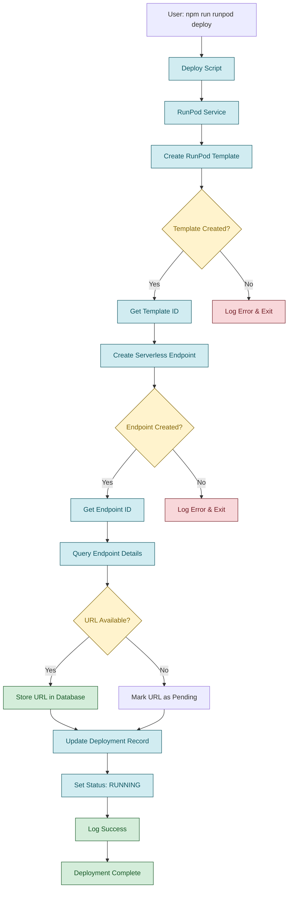
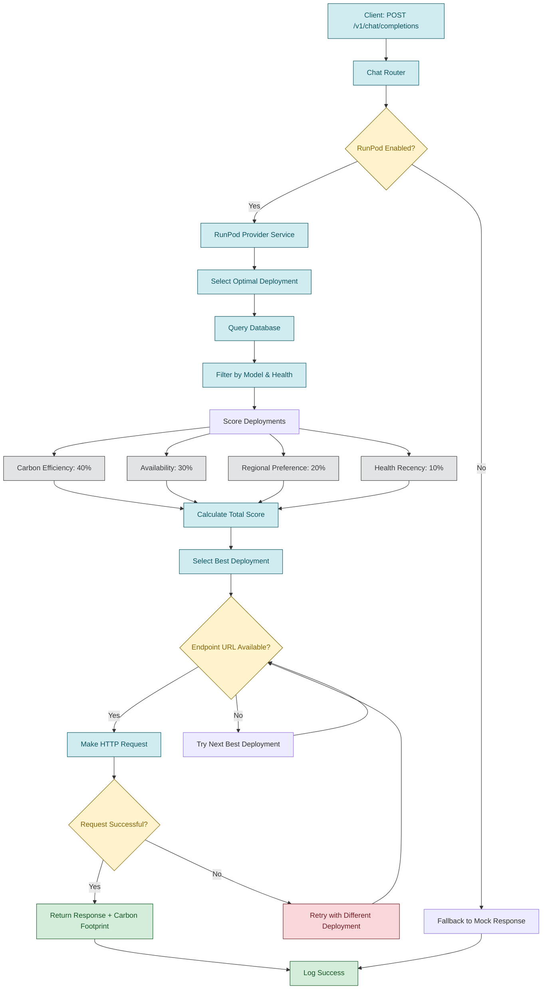
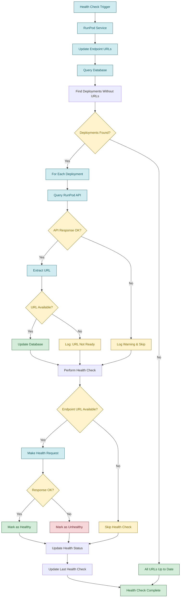
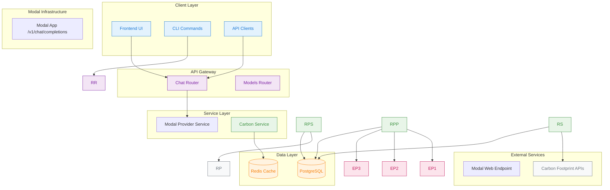

# Endpoint Discovery and Routing Flow

This diagram shows how the carbon-aware LLM proxy routes requests to a single Modal-hosted endpoint.

## Deployment Flow



## Request Routing Flow



## Health Check & URL Discovery Flow



## Database Schema & Relationships

```mermaid
erDiagram
    %% Novita entities removed
        uuid id PK
        string modelId
        string region
        string gpuType
        enum status
        enum deploymentType
        int minReplicas
        int maxReplicas
        int currentReplicas
        boolean autoScaling
        string endpointUrl
        string novitaDeploymentId
        string novitaModelId
        jsonb configuration
        timestamp lastHealthCheck
        string healthStatus
        decimal carbonIntensity
        decimal deploymentCostPerHour
        bigint totalRequests
        bigint totalTokens
        decimal successRate
        timestamp createdAt
        timestamp updatedAt
    }

    %% Novita entities removed
        uuid id PK
        uuid deploymentId FK
        string novitaInstanceId
        enum status
        string instanceName
        int gpuCount
        int vcpuCount
        int memoryGb
        string internalIp
        string externalIp
        jsonb portMappings
        decimal costPerHour
        decimal totalCost
        timestamp lastActivity
        timestamp startedAt
        timestamp stoppedAt
    }

    ModelInfo {
        uuid id PK
        string name
        string provider
        string modelType
        int parameterCount
        decimal costPer1kTokens
        int tokensPerSecond
        jsonb capabilities
        boolean isActive
        timestamp createdAt
        timestamp updatedAt
    }

    %% Legacy RunPod entities removed; Modal does not track deployments in DB
```

## System Architecture Overview



## Key Components Summary

### **Deployment Management**

- **RunPod Service**: Handles template and endpoint creation
- **URL Discovery**: Automatically fetches endpoint URLs after creation
- **Database Tracking**: Stores deployment metadata and status

### **Request Routing**

- **Carbon-Aware Selection**: Prioritizes low-carbon regions
- **Health-Based Routing**: Only routes to healthy endpoints
- **Failover Logic**: Automatically retries with different deployments

### **Health Monitoring**

- **Periodic Checks**: Regular health monitoring of all endpoints
- **URL Updates**: Automatic discovery of missing endpoint URLs
- **Status Tracking**: Real-time health status in database

### **Carbon Efficiency**

- **Regional Scoring**: Norway (0.017), Sweden (0.045), Oregon (0.155), California (0.233) kg CO2e/kWh
- **Weighted Selection**: 40% carbon efficiency, 30% availability, 20% regional preference, 10% health recency

This architecture ensures reliable, carbon-efficient LLM request routing with automatic endpoint discovery and health monitoring.
